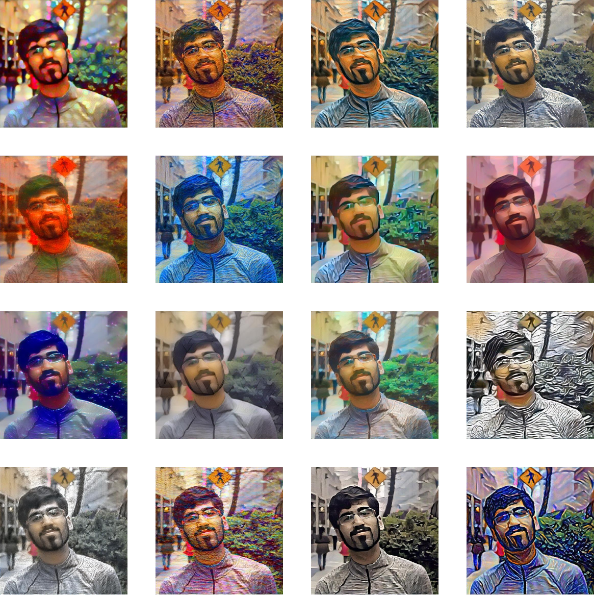

# Neural Style Transfer
My best friend loves pictures. After learning about Neural Style Transfer in [Andrew Ng's CNN course](https://www.coursera.org/learn/convolutional-neural-networks/), I wanted to use the algorithm to make her fancy profile photos!

Unfortunately, my implementation of the algorithm was too slow :grin: I ran the content, style, and generated images through the VGG11 network on every iteration and then computed costs separately. 

Luckily, I found this [Pytorch tutorial](https://pytorch.org/tutorials/advanced/neural_style_tutorial.html) that had a much faster implementation! It pre-computed content and style image 'encodings' beforehand so that it wouldn't have to run 3 images through the network on every iteration. And it calculated losses as the image ran through the network!

### How to Use
If you want to try out the algorithm yourself, first:
- Download the `main-algorithm.ipynb` notebook. I'd recommend using [Kaggle](https://kaggle.com) to run it. 
- Download the `./styles/styles` image folder for sample style images. Note that these images aren't mine - I just found them on Google. You can find your own too. 
- Find some profile pictures of your own or download `Example Content Image.jpg` to just test out the algorithm. 

Then, just follow instructions in the Python Notebook
Note: If you don't crop your images to a square aspect ratio, the algorithm will automatically crop the centre portion of the image - which may or may not be what you want. You can use [Birme](https://birme.net) to crop images if you prefer. 

### Screenshots
Here's the original image

And here's a gallery of the output images

